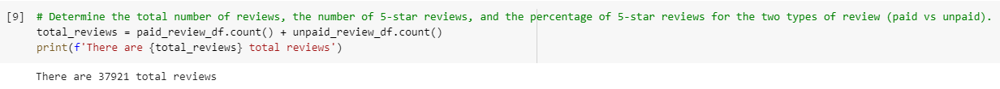
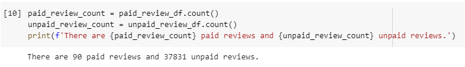
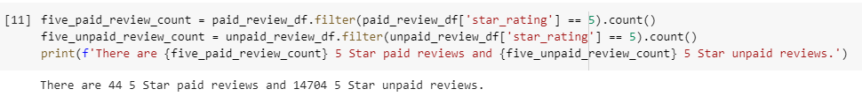
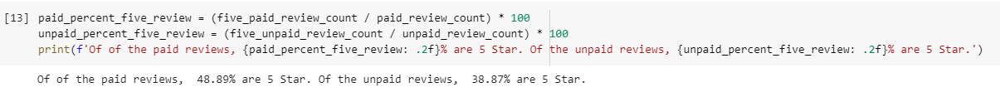

# Amazon_Vine_Analysis

## Overview

- In this analysis, we look specifically at Amazon video game reviews, and see if there's any material difference in 5-star reviews for both paid vine reviews and unpaid vine reviews in their video game selection.

## Results

### Count of total reviews

- In total, there were xx total video games views, inclusive of paid and unpaid reviews.

### Count of paid and unpaid reviews

- Of the 37,921 total reviews, there were 90 total paid reviews and 37,831 unpaid reviews.

### Count of 5-star vine reviews vs. 5-star non-vine reviews

- There were 44 5-star paid reviews and 14,704 5-star unpaid reviews.

### Percentage of 5-star vine reviews  vs. 5-star non-vine reviews

- Of the paid reviews, 48.89% were 5-star reviews.  Of the unpaid reviews, 38.87% were 5-star reviews.

## Summary

When looking holistically at all results, a few conclusions can be drawn.  The first being, that there does appear to be bias for positive paid reviews, as the amount of 5-star reviews is about 10% higher than that of unpaid 5-star reviews.  That being said, there were only 90 paid reviews in total, compared to almost 38,000 unpaid reviews.  It would be helpful to see a higher sample size for paid reviews to see if the 5-star breakout still remains near the 48.89% threshold of all paid reviews, or if that mark reverts closer to the 38.87% exhibited in the 5-star unpaid reviews.

One helpful analysis would be to increase measurement size from sub-category of only video games and go up to another overarching parent category that has much more data available, such as hardlines or electronics, just as long as the product being measured is still within a similar consumer interest zone.  By acquiring a larger pool of reviews, and thus a higher sample size of both paid and unpaid reviews, this should be more beneficial to see the true penetration of 5-star reviews in both the paid and unpaid categories and see how they compare/contrast.